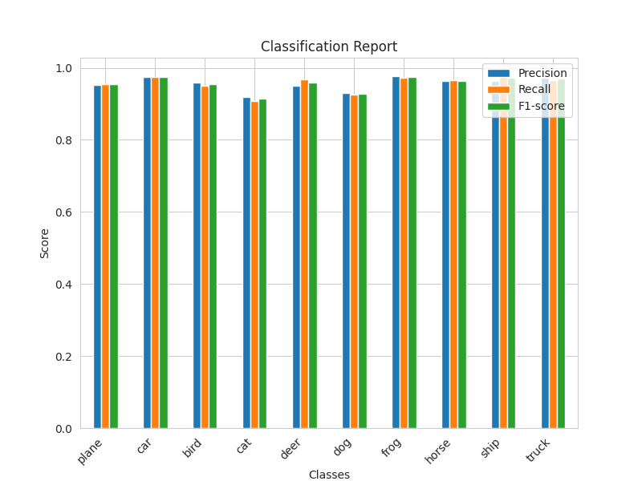

# Teacher Student Model From Scratch
## Introduction
The goal of knowledge distillation is **to maintain the accuracy of the teacher model while reducing the computational cost of the student model.** In this project, I implement a vanilla knowledge distillation using basic teacher-student model from scratch trained on CIFAR10 using Pytorch. The teacher model is based on ResNet50. The student model is a model with 5 layers of CNN and 1 layer of fully connected layer.

The teacher-student model is trained with knowledge distillation. The loss function is a combination of cross entropy loss and knowledge distillation loss. The cross entropy loss is used to calculate the loss between the output of the student model and the ground truth. For more details, please refer to this [website](https://intellabs.github.io/distiller/knowledge_distillation.html).

## Environment
- Python 3.10.11
- Pytorch 1.13.1
- Torchvision 0.14.1
- CUDA 11.7

## Organization
```
.
├── checkpoints
│   └── some output `.pt` files
├── data
│   └── cifar-10-batches-py
│       └── ...
├── imgs
│   └── some folders that contain output images
├── config.py
├── utils.py
├── custom_resnet50.py
├── teacher_student_model.py
├── evaluation.py
└── README.md
```

- Folder `checkpoints`, `data`, `imgs` are created automatically when running the code.
- The `custom_resnet50.py` is the same as teacher model in `teacher_student_model.py`. I just created it first to try to train the ResNet50 on CIFAR10.

## Dataset
CIFAR10 dataset is used in this project. The dataset is automatically downloaded by Pytorch. The training set contains 50000 images and the test set contains 10000 images. The original image shape is `(3, 32, 32)`, but I resize the image to `(3, 224, 224)` to fit the input shape of ResNet50. And also normalize the image with mean `(0.485, 0.456, 0.406)` and standard deviation `(0.229, 0.224, 0.225)`.

## Training Setup
<table align="center" border="1" style="text-align:center">
  <tr>
    <th style="text-align:center;"><b></b></th>
    <th style="text-align:center;"><b>Teacher model</b></th>
    <th style="text-align:center;"><b>Student model</b></th>
  </tr>
  <tr>
    <th>Batch Size</th>
    <td>100</td>
    <td>100</td>
  </tr>
  <tr>
    <th>Epochs</th>
    <td>5</td>
    <td>10</td>
  </tr>
  <tr>
    <th>Optimizer</th>
    <td colspan="2">SGD with learning rate 0.001, momentum 0.9</td>
  </tr>
  <tr>
    <th>Loss Function</th>
    <td>Cross Entropy Loss</td>
    <td>Knowledge Distillation Loss with alpha 0.5 and temperature 1</td>
  </tr>
</table>

## How to run it?
1. Clone this repository

    ```
    $ git clone https://github.com/ghnmqdtg/teacher-student-model-from-scratch
    ```

2. Install the required packages

    ```
    $ pip install -r requirements.txt
    ```

3. Train the teacher-student model

    ```
    $ python teacher_student_model.py.py
    ```

4. Evaluate the teacher-student model

    ```
    $ python evaluate.py
    ```

## Results
- Comparison of accuracy between teacher and student model

<table width="50%" align="center" border="1" style="text-align:center">
  <caption><b>Accuracy for both teacher and student model</b></caption>
  <tr>
    <th style="text-align:center;">Class</th>
    <th style="text-align:center;">Teacher</th>
    <th style="text-align:center;">Student</th>
    <th style="text-align:center;">Basic CNN</th>
  </tr>
  <tr>
    <td>plane</td>
    <td>96.8 %</td>
    <td>68.2 %</td>
    <td>78.1 %</td>
  </tr>
  <tr>
    <td>car</td>
    <td>97.1 %</td>
    <td>84.2 %</td>
    <td>75.9 %</td>
  </tr>
  <tr>
    <td>bird</td>
    <td>96.4 %</td>
    <td>49.8 %</td>
    <td>52.2 %</td>
  </tr>
  <tr>
    <td>cat</td>
    <td>92.0 %</td>
    <td>45.5 %</td>
    <td>42.6 %</td>
  </tr>
  <tr>
    <td>deer</td>
    <td>95.3 %</td>
    <td>63.4 %</td>
    <td>58.9 %</td>
  </tr>
  <tr>
    <td>dog</td>
    <td>92.3 %</td>
    <td>49.2 %</td>
    <td>65.4 %</td>
  </tr>
  <tr>
    <td>frog</td>
    <td>98.1 %</td>
    <td>86.0 %</td>
    <td>80.9 %</td>
  </tr>
  <tr>
    <td>horse</td>
    <td>97.8 %</td>
    <td>75.1 %</td>
    <td>67.7 %</td>
  </tr>
  <tr>
    <td>ship</td>
    <td>98.3 %</td>
    <td>77.2 %</td>
    <td>77.1 %</td>
  </tr>
  <tr>
    <td>truck</td>
    <td>97.2 %</td>
    <td>78.2 %</td>
    <td>75.9 %</td>
  </tr>
  <tr>
    <td>Overall</td>
    <td>96.1 %</td>
    <td>67.7 %</td>
    <td>67.5 %</td>
  </tr>
</table>


- Comparison of statistics between teacher and student model

  <table align="center" width="100%" border="0">
    <tr>
        <td colspan="2" style="text-align:center; font-size:14px;"><b>Confusion Matrix<b></td>
    </tr>
    <tr>
        <td width="33%" style="text-align:center;font-size:14px;"><b>Teacher<b></td>
        <td width="33%" style="text-align:center;font-size:14px;"><b>Student<b></td>
        <td width="33%" style="text-align:center;font-size:14px;"><b>Basic CNN<b></td>
    </tr>
    <tr>
        <td></img></td>
        <td></img></td>
        <td></img></td>
    </tr>
    <tr>
        <td colspan="2" style="text-align:center; font-size:14px;"><b>Classification Report<b></td>
    </tr>
    <tr>
        <td width="33%" style="text-align:center;font-size:14px;"><b>Teacher<b></td>
        <td width="33%" style="text-align:center;font-size:14px;"><b>Student<b></td>
        <td width="33%" style="text-align:center;font-size:14px;"><b>Basic CNN<b></td>
    </tr>
    <tr>
        <td></img></td>
        <td></img></td>
        <td></img></td>
    </tr>
  </table>


The above teacher model results are actully generated by the `custom_resnet50.py`. It's a little bit weird that the training result of the teacher model is great (about 96% accuracy), but when I tring to manully evaluate it by using `evaluate.py`, it only gets 10% accuracy. I'm still trying to figure out what's going on.