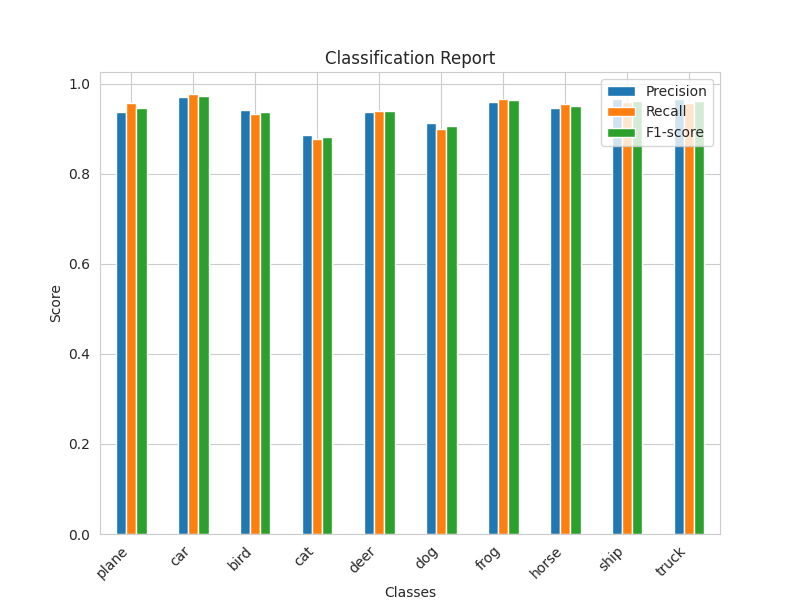

# Teacher Student Model From Scratch
## Introduction
The goal of knowledge distillation is **to maintain the accuracy of the teacher model while reducing the computational cost of the student model.** In this project, I implement a vanilla knowledge distillation using basic teacher-student model from scratch trained on CIFAR10 using Pytorch. The teacher model is based on ResNet50, and the student model is based on ResNet18.

The teacher-student model is trained with knowledge distillation. The loss function is a combination of cross entropy loss and knowledge distillation loss. The cross entropy loss is used to calculate the loss between the output of the student model and the ground truth. For more details, please refer to this [website](https://intellabs.github.io/distiller/knowledge_distillation.html).

## Environment
- Python 3.10.11
- Pytorch 1.13.1
- Torchvision 0.14.1
- CUDA 11.7

## How to run it?

1. Clone this repository

    ```
    $ git clone https://github.com/ghnmqdtg/teacher-student-model-from-scratch
    ```

2. Install the required packages

    ```
    $ pip install -r requirements.txt
    ```

3. Train the teacher-student model

    ```
    $ python teacher_student_model.py.py
    ```

4. Evaluate the teacher-student model

    ```
    $ python evaluate.py
    ```


## Organization

```
.
├── checkpoints
│   └── some output `.pt` files
├── data
│   └── cifar-10-batches-py
│       └── ...
├── imgs
│   └── some folders that contain output images
├── config.py
├── utils.py
├── custom_resnet50.py
├── teacher_student_model.py
├── evaluation.py
└── README.md
```

- Folder `checkpoints`, `data`, `imgs` are created automatically when running the code.
- I just created `custom_resnet.py` first to try to train the ResNet50 and ResNet18 model on CIFAR10 respectively. Then I use the same model in `teacher_student_model.py`.

## Dataset
CIFAR10 dataset is used in this project. The dataset is automatically downloaded by Pytorch. The training set contains 50000 images and the test set contains 10000 images. The original image shape is `(3, 32, 32)`, but I resize the image to `(3, 224, 224)` to fit the input shape of ResNet50. And also normalize the image with mean `(0.485, 0.456, 0.406)` and standard deviation `(0.229, 0.224, 0.225)`.

## Training Setup

|         |   Teacher (ResNet50)   |  Student (ResNet18 without KD)  |   Student (ResNet18 with KD)  |
|---------|:---------------------:|:----------------------------:|:---------------------------:|
| Batch Size |          100          |              100             |             100              |
| Epochs    |           5           |               5              |              10              |
| Optimizer | SGD with learning rate 0.001 and momentum 0.9 | SGD with learning rate 0.001 and momentum 0.9 | SGD with learning rate 0.001 and momentum 0.9 |
| Loss      |     Cross Entropy Loss    |         Cross Entropy Loss         | KD Loss with alpha 0.25 and temperature 5 |


## Results
- Comparison of accuracy between teacher, student and student without knowledge distillation.

  |     Class     |    Teacher (ResNet50)    |   Student (ResNet18 with KD)  | Student (ResNet18 without KD) |
  |:-------------:|:------------------------:|:-----------------------------:|:-----------------------------:|
  |     Plane     |          96.1 %          |            95.6 %             |            95.7 %             |
  |      Car      |          97.0 %          |            97.7 %             |            96.6 %             |
  |      Bird     |          95.4 %          |            93.2 %             |            93.2 %             |
  |      Cat      |          91.2 %          |            87.7 %             |            86.8 %             |
  |      Deer     |          95.5 %          |            94.0 %             |            93.6 %             |
  |      Dog      |          91.9 %          |            89.9 %             |            92.1 %             |
  |      Frog     |          97.6 %          |            96.7 %             |            96.6 %             |
  |     Horse     |          95.5 %          |            95.4 %             |            95.6 %             |
  |      Ship     |          97.4 %          |            96.0 %             |            95.1 %             |
  |     Truck     |          96.2 %          |            95.8 %             |            95.3 %             |
  |     Overall   |        **95.4 %**        |         **94.2 %**            |         **94.1 %**            |


- Comparison of statistics between teacher and student model

  <table align="center" width="100%" border="0">
    <tr>
        <td colspan="3" style="text-align:center; font-size:14px;"><b>Confusion Matrix<b></td>
    </tr>
    <tr>
        <td width="33%" style="text-align:center;font-size:14px;"><b>Teacher (ResNet50)<b></td>
        <td width="33%" style="text-align:center;font-size:14px;"><b>Student (ResNet18 with KD)<b></td>
        <td width="33%" style="text-align:center;font-size:14px;"><b>Student (ResNet18 without KD)<b></td>
    </tr>
    <tr>
        <td></img></td>
        <td></img></td>
        <td></img></td>
    </tr>
    <tr>
        <td colspan="3" style="text-align:center; font-size:14px;"><b>Classification Report<b></td>
    </tr>
    <tr>
        <td width="33%" style="text-align:center;font-size:14px;"><b>Teacher (ResNet50)<b></td>
        <td width="33%" style="text-align:center;font-size:14px;"><b>Student (ResNet18 with KD)<b></td>
        <td width="33%" style="text-align:center;font-size:14px;"><b>Student (ResNet18 without KD)<b></td>
    </tr>
    <tr>
        <td></img></td>
        <td></img></td>
        <td></img></td>
    </tr>
  </table>

The result of the student model with knowledge distillation is **"slightly"** better than the student model without knowledge distillation. But just slightly, it can almost be ignored. I'm wondering if I did something wrong. If you know what's wrong, please let me know. Thank you.

## References
- [Knowledge Distillation](https://intellabs.github.io/distiller/knowledge_distillation.html)
- [Implementation of Teacher-Student Model in PyTorch](https://abdulkaderhelwan.medium.com/implementation-of-teacher-student-model-in-pytorch-a1195734dd08)
- [Knowledge Distillation in a Deep Neural Network](https://medium.com/analytics-vidhya/knowledge-distillation-in-a-deep-neural-network-c9dd59aff89b)
- [Maximizing Model Performance with Knowledge Distillation in PyTorch](https://medium.com/artificialis/maximizing-model-performance-with-knowledge-distillation-in-pytorch-12b3960a486a)
